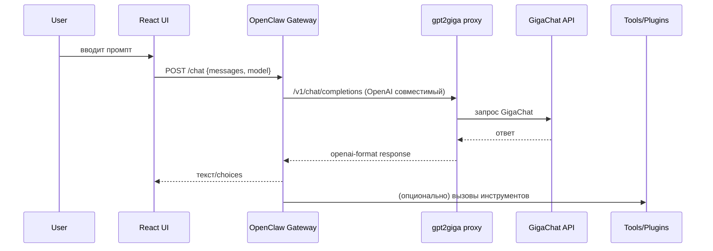

# FLOW — как проходит запрос

## Кратко по шагам
1) Пользователь вводит промпт в React UI (порт 5173 при `npm run dev`).  
2) UI шлёт `POST /chat` на Gateway (`http://localhost:3001`, модель `gigachat/*`).  
3) OpenClaw Gateway читает `config/openclaw.json` (или `openclaw.local.json`) и отправляет запрос в провайдер `gigachat`.  
4) Провайдер указывает `baseUrl` на gpt2giga proxy (`http://gpt2giga:8443` в Docker или `http://127.0.0.1:8443` локально).  
5) gpt2giga конвертирует OpenAI‑совместимый вызов в нативный GigaChat API, добавляя токен из `GIGACHAT_CREDS` и scope `GIGACHAT_API_PERS`.  
6) GigaChat отвечает → gpt2giga возвращает в формате OpenAI → Gateway отдаёт UI.  
7) Если у агента есть инструменты/плагины, Gateway вызывает их между шагами 3–6; файлы/логи кладутся в `agents/ruslan/workspace`.

## Диаграмма последовательности

## Порты и окружение
- gpt2giga: 8443 (`GIGACHAT_CREDS`, `GIGACHAT_SCOPE`, `VERIFY_SSL=false`).  
- Gateway: 3001 (`OPENCLAW_CONFIG`, `GATEWAY_PORT`).  
- Фронт: 5173 (Vite dev) или любой, если билдите отдельно (`VITE_API_URL=http://localhost:3001`).  
- Workspace агента: `agents/ruslan/workspace` (в Docker монтируется в `/root/.openclaw/agents/ruslan/workspace`).

## Два режима запуска
- **Docker**: `docker compose -f infra/docker-compose.yml up -d --build` — использует `config/openclaw.json`, обращается к `gpt2giga` по имени сервиса.  
- **Локальный npm**: `pip install gpt2giga` → запустить прокси → `npm install && npm run gateway:local` — использует `config/openclaw.local.json`, обращается к `127.0.0.1:8443`.

## Точки отказа / проверки
- Нет токена или неверный scope → gpt2giga вернёт 401/403.  
- Порт 8443 занят или прокси завис → curl healthcheck упадёт (см. `scripts/dev/check.sh`).  
- 307 на `/v1/models` → добавьте `-L` в curl (в healthcheck уже есть).
